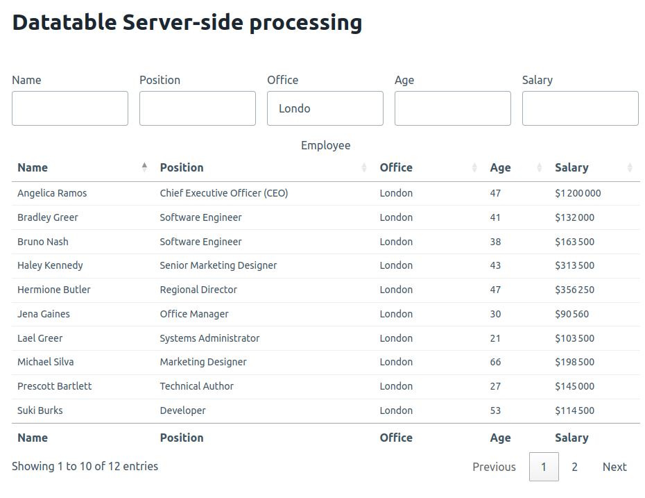

# Datatable Server-side processing

Simple implementation of datatable service-side processing with symfony

## Overview

This project provides a straightforward example of how to implement DataTables with server-side processing in a Symfony application. 
It demonstrates how to set up a DataTable that retrieves and processes data efficiently on the server



## Prerequisites

- [Symfony](https://symfony.com/download)
- [Composer](https://getcomposer.org/)

## Installation

```bash
composer install
php bin/console doctrine:database:create
php bin/console doctrine:migrations:migrate
```

## Usage

Start the Symfony server:

```bash
symfony serve -d
```

### Documentation
https://datatables.net/manual/server-side

https://datatables.net/examples/server_side/
